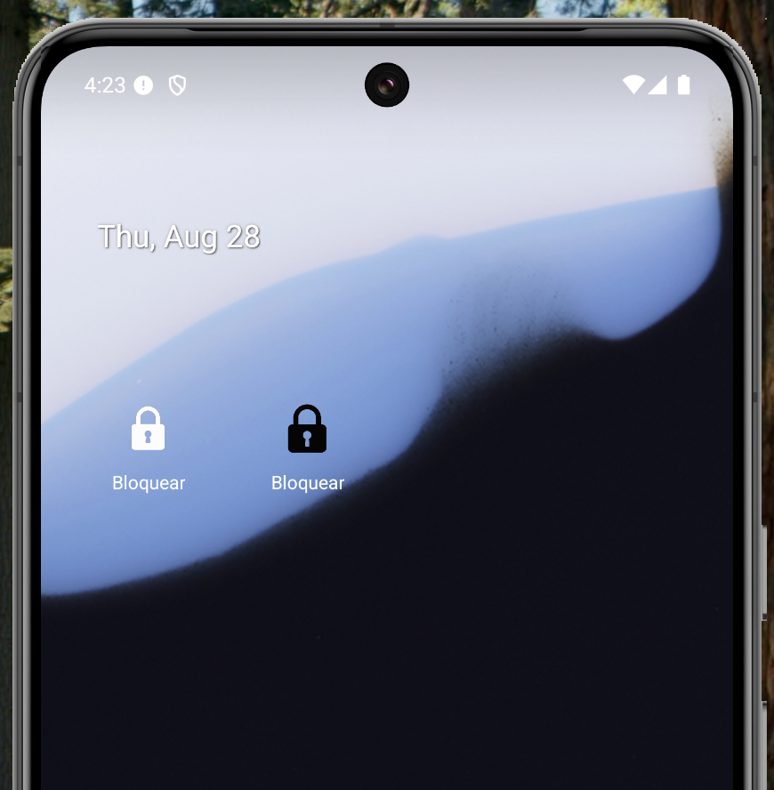
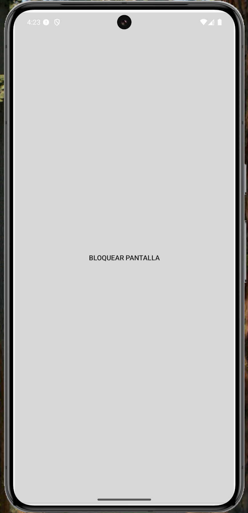

# LockDeviceApp

Aplicación Android para bloquear la pantalla rápidamente mediante widgets y botón principal.

## Imágenes

| Widgets (Claro y Oscuro) | Pantalla Principal |
|:-----------------------:|:------------------:|
|   |     |

## Descarga

Disponible en Google Play:
[LockDeviceApp en Play Store](https://play.google.com/store/apps/details?id=net.noemec.lockdeviceapp)

## Política de Privacidad

Consulta la política de privacidad aquí: [https://lockapp.noemec.net/](https://lockapp.noemec.net/)

## Créditos

Desarrollado por [noemec.net](https://noemec.net/)

## Guideline para contribuir

¡Gracias por tu interés en aportar! Sigue estas recomendaciones:

- Haz un fork del repositorio y crea una rama para tu aporte.
- Describe claramente el propósito de tu PR.
- Mantén el código limpio y documentado.
- Si agregas funcionalidades, incluye pruebas y documentación.
- Respeta la estructura y convenciones del proyecto.
- Para dudas o sugerencias, abre un issue.

¡Toda contribución es bienvenida!
